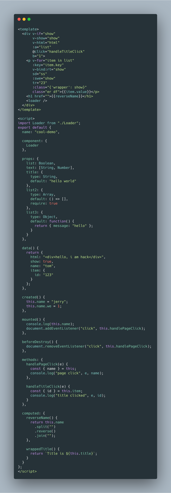
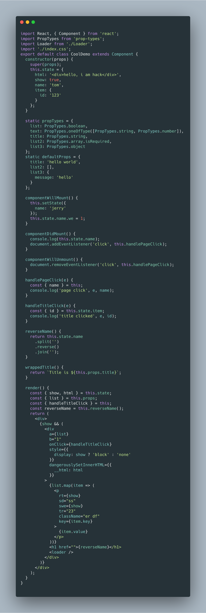
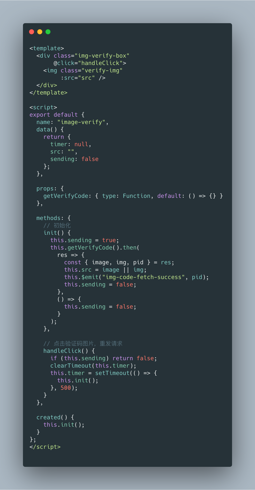
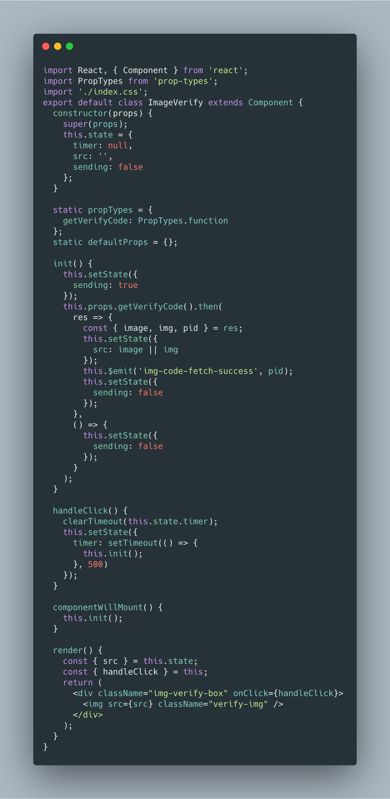

# vue2react

A tool that transforms Vue component to React component.

The tool will be more stronger and supports more syntax.

## Install

```bash
npm i vue2react -g
```

or

```bash
yarn add vue2react -g
```

## Usage

bash example

```bash
vtr -i hello.vue -o ./screen -n nihao.js
vtr hello.vue ./screen nihao.js
vtr hello.vue
```

vtr help infomation

```bash
Usage: vtr [options]

Options:
  -V, --version  output the version number
  -i, --input    the input path for vue component
  -o, --output   the output path for react component, which default value is process.cwd()
  -n, --name     the output file name, which default value is "react.js"
  -h, --help     output usage information
```

## Support

- Data
  - [x] data
  - [x] props
  - [x] propsData
  - [x] computed
  - [x] methods
  - [ ] watch
- DOM
  - [ ] el
  - [x] template
  - [ ] render
  - [ ] renderError
- Lifecycle Hooks
  - [x] created
  - [x] mounted
  - [x] updated
  - [x] beforeDestroy
  - [x] errorCaptured
- Directives
  - [ ] v-text
  - [x] v-html
  - [x] v-show
  - [x] v-if
  - [ ] v-else
  - [ ] v-else-if
  - [x] v-for
  - [x] v-on / @
  - [x] v-bind / :
  - [ ] v-model
  - [ ] v-pre
  - [ ] v-cloak
  - [ ] v-once
- Special Attributes
  - [x] key
  - [ ] ref

## Example

#### Demo1

<table>
  <tr>
    <td>
      Vue Code
    </td>
    <td>
      React Code
    </td>
  </tr>
  <tr>
    <td>
      
    </td>
    <td>
      
    </td>
  </tr>
</table>

#### Demo2

<table>
  <tr>
    <td>
      Vue Code
    </td>
    <td>
      React Code
    </td>
  </tr>
  <tr>
    <td>
      
    </td>
    <td>
      
    </td>
  </tr>
</table>

## Inspired by

[vue-to-react](https://github.com/dwqs/vue-to-react)
